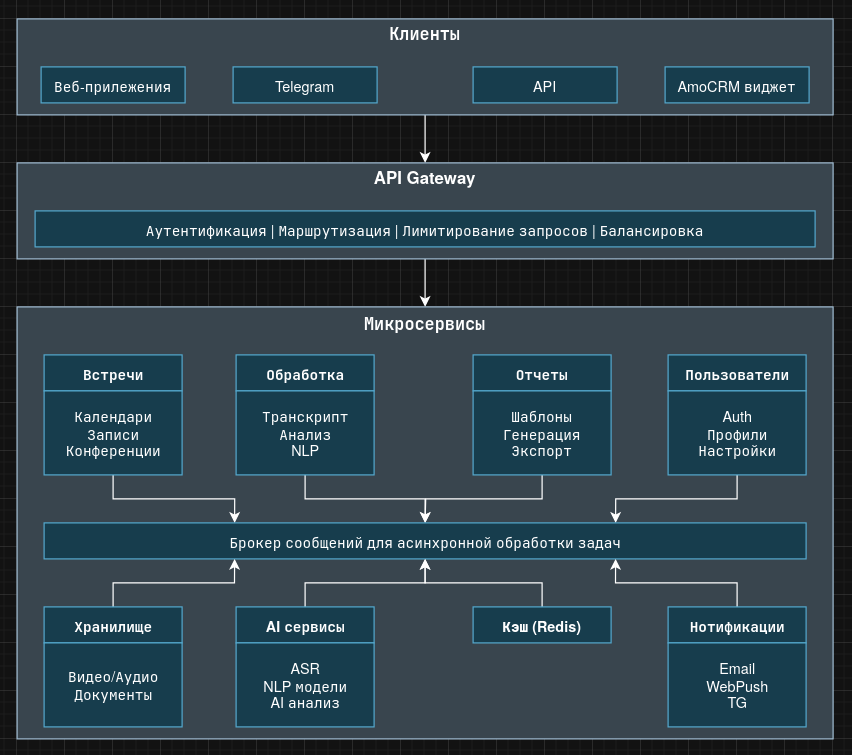

# MyMeet Scraper

# Задание 1

## Запуск

1. Создай файл `.env` в директории `infra/` со следующим содержимым:

```env
OUTPUT_DIR=../output
BASE_URL=http://mymeet.ai/
````

2. Запусти контейнер:

```bash
cd infra
docker-compose up --build
```

3. Результаты появятся в директории, указанной в `OUTPUT_DIR` (по умолчанию `../output`).

---

## Результаты

- Текст: `output/text/main_page.txt`
- Картинки: `output/images/`

# Задание 2

## Архитектура системы

### 1. **Входной слой — API Gateway**

- Используем **Nginx** как точку входа.
- Обеспечивает:
  - Аутентификацию (JWT / OAuth2)
  - Лимитирование
  - Проксирование к микросервисам

---

### 2. **Микросервисная архитектура на Python (FastAPI)**

Каждая логическая зона (например, встречи, загрузки, отчёты) — это отдельный сервис:

- Пишем на **FastAPI** (асинхронность, OpenAPI из коробки)
- Каждый сервис со своей БД
- Взаимодействие — через HTTP + брокер сообщений

---

### 3. **Очереди и фоновые задачи — RabbitMQ или Kafka**

- Тяжёлые задачи (ASR, генерация отчётов) идут в очередь
- Обработка через воркеры (Celery или custom asyncio-сервис)
- Возможны ретраи и отложенные задачи

---

### 4. **Хранилище**

- **PostgreSQL** — основная БД (встречи, транскрипты, отчёты)
- **MinIO или AWS S3** — для видео/аудио файлов
- **Redis** — кэш, сессии, временные токены
- **Elasticsearch** — для быстрого поиска по транскриптам

---

### 5. **ИИ-сервисы**

- ASR (Whisper) — для получения текста из аудио
- NLP-модули — на базе LLM или spaCy — анализ текста, создание отчётов
- Вынесены в отдельные сервисы, масштабируются независимо

---

### 6. **Интеграции**

- **Google Calendar / Microsoft Graph API** — для автоматического подключения к встречам
- **Zoom / Teams API** — для входа в конференцию
- **SMTP / Email API** — для рассылки отчётов

---

## Основные сценарии работы

1. **Запись встречи**
    - Пользователь создаёт встречу → сервис подключается к конференции в нужное время
    - Аудио/видео пишется, сохраняется в S3
    - В очередь отправляется задача на транскрибацию

2. **Обработка**
    - ASR сервис обрабатывает запись → получает текст
    - NLP анализирует транскрипт → создаётся отчёт
    - Отчёт сохраняется и отправляется пользователям

3. **Загрузка файла**

    - Пользователь загружает аудио/видео
    - Файл валидируется, кладётся в S3
    - Запускается тот же pipeline обработки

---

## Возможные bottleneck-и и как решать

|Проблема|Возможное решение|
|---|---|
|Большие видеофайлы тормозят систему|Асинхронная обработка + горизонтальное масштабирование ASR|
|Пиковые нагрузки (много встреч)|Redis-кэш, автоскейлинг микросервисов, репликация БД|
|Медленные сторонние API (Zoom, MS Teams)|Фоновые ретраи, локальный кэш, таймауты, graceful degradation|
|Растущие объёмы медиа|S3 lifecycle policies, компрессия, tiered storage|

---

## Технологии и стек

| Компонент    | Технологии                                       |
| ------------ | ------------------------------------------------ |
| Backend      | Python, FastAPI, Celery                          |
| API Gateway  | Nginx                                            |
| БД           | PostgreSQL, Redis, S3, Elasticsearch             |
| Очереди      | RabbitMQ / Kafka                                 |
| AI           | Whisper, spaCy / LLM                             |
| DevOps       | Docker, Prometheus, Grafana, ELK, GitHub Actions |
| Безопасность | OAuth2, HTTPS, RBAC, шифрование данных           |

---

